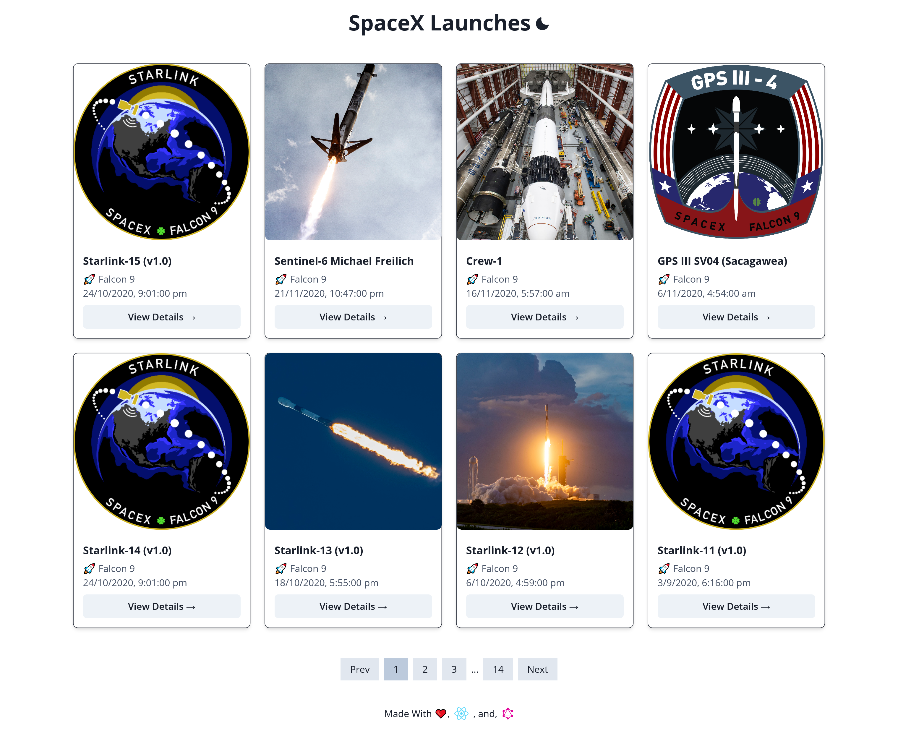
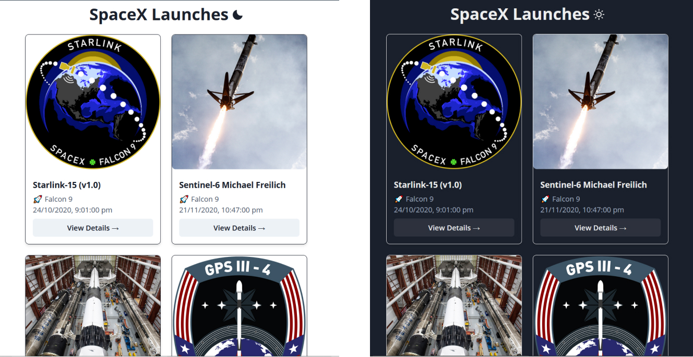
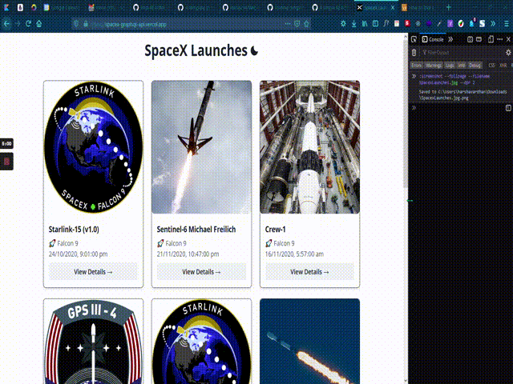

# 

 &emsp;  &emsp; 

## Description

This is a small web application for displaying the details of SpaceX Launches.

## Demo

Here is a working live demo : <https://spacex-graphql-api.vercel.app/>

## Features

- Dark and Light Themes

- Responsive Design

- PWA (Progressive Web App)

- Image Lazy Loading

- Component Lazy Loading (Route Splitting)

## Bug Report / Feature Request

If you find a bug (the website couldn't handle the query and / or gave undesired results), kindly open an issue [here](https://github.com/HarshaVardhanNakkina/spacex-graphql-api/issues/new) by including your search query and the expected result.

If you'd like to request a new function, feel free to do so by opening an issue [here](https://github.com/HarshaVardhanNakkina/spacex-graphql-api/issues/new). Please include sample queries and their corresponding results.

## Built with

- [Spacex Graphql API](https://api.spacex.land/graphql/)
- [Reactjs](https://reactjs.org/) - React makes it painless to create interactive UIs. Build encapsulated components that manage their own state, then compose them to make complex UIs.
- [Apollo React Client](https://www.apollographql.com/docs/react/) - Apollo Client is a comprehensive state management library for JavaScript that enables you to manage both local and remote data with GraphQL. Use it to fetch, cache, and modify application data, all while automatically updating your UI.
- [GraphQL Code Generator](https://www.graphql-code-generator.com/) - Generate code from your GraphQL schema and operations with a simple CLI.
- [Chakra UI](https://chakra-ui.com/) - Chakra UI is a simple, modular and accessible component library that gives you the building blocks you need to build your React applications.
- [Reach Router](https://reach.tech/router/) - Reach Router is a small, simple router for React that borrows from React Router, Ember, and Preact Router.
- [Parcel](https://parceljs.org/) - Blazing fast, zero configuration web application bundler.
- [Workbox](https://developers.google.com/web/tools/workbox/) - Workbox is a library that bakes in a set of best practices and removes the boilerplate every developer writes when working with service workers.
- [Yarn](https://yarnpkg.com/) - Yarn is a package manager that doubles down as project manager. Whether you work on one-shot projects or large monorepos, as a hobbyist or an enterprise user, we've got you covered.

## Contribution

Want to contribute? Thank, you!

To fix a bug or enhance an existing module, follow these steps:

- Fork the repo
- run `yarn install` or simply `yarn`
- Create a new branch (`git checkout -b improve-feature`)
- Make the appropriate changes in the files
- Commit your changes
- Push to the branch (`git push origin improve-feature`)
- Create a Pull Request

## To-do

- Add more accessibility features.
- Keep pagination in the home page only
- Photo slider to view photos in the launch details page
